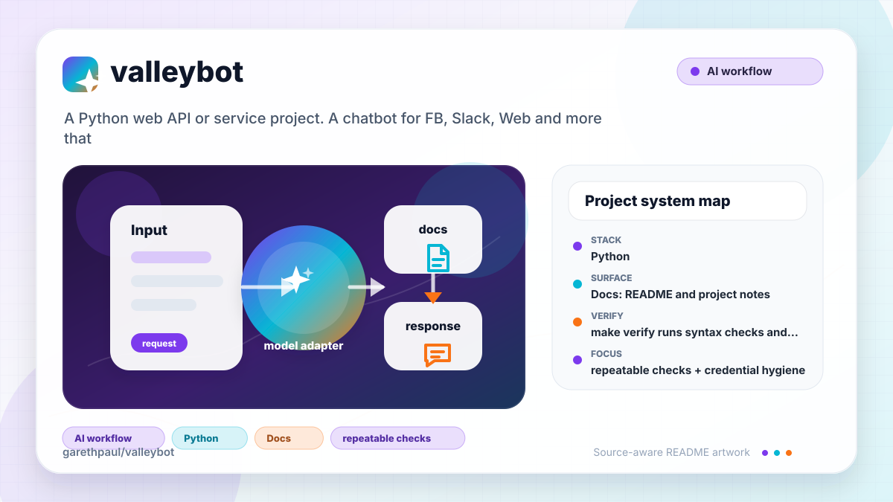

# valleybot

<!-- README-OVERVIEW-IMAGE -->


## Overview

`garethpaul/valleybot` is a Python web API or service project. A chatbot for FB, Slack, Web and more that responds as a "typical" character from Silicon Valley.

This README is based on the checked-in source, manifests, scripts, and repository metadata on the `master` branch. The project language mix found during review was: Python (4).

## Repository Contents

- `README.md` - project overview and local usage notes
- `.github/workflows/check.yml` - GitHub Actions baseline for `make check`
- `requirements.txt` - Python dependency or packaging metadata
- `app.json`
- `app.py`
- `docs` - source or example code
- `nltk_data` - source or example code
- `Procfile`
- `SECURITY.md` - security reporting and disclosure guidance
- `VISION.md` - project direction and maintenance guardrails

Additional scan context:

- Source directories: docs, nltk_data
- Dependency and build manifests: Procfile, app.json, requirements.txt
- Entry points or build surfaces: app.py
- Test-looking files: bot_tests.py, nltk_data/corpora/conll2000/test.txt

## Getting Started

### Prerequisites

- Git
- Python 3.10 or newer; deployment tracks the Python 3.14 line

### Setup

```bash
git clone https://github.com/garethpaul/valleybot.git
cd valleybot
python -m pip install -r requirements.txt
make prepare-corpora
```

The setup commands above are derived from repository files. Legacy mobile, Python, or JavaScript samples may require older SDKs or package versions than a modern workstation uses by default.

## Running or Using the Project

- Run `python app.py` after installing Python dependencies. Bottle debug mode
  remains off unless `BOTTLE_DEBUG=true` is explicitly set for local work.

## Testing and Verification

- `make verify` runs syntax checks and dependency-free Messenger and Slack
  route contract checks, including Slack signing secret verification and Slack
  command text validation, bounded web chat text validation, web template
  escaping, bot JSON request validation, bot conversation log privacy, plus
  request timeout parsing checks. Slack command text, Messenger webhook object type, Messenger
  webhook text, and Messenger sender IDs must be valid before response
  generation. Recent Messenger message IDs are claimed in a bounded in-memory
  cache so provider retries do not send duplicate replies; outbound exceptions
  release their claim for recovery. Unsuccessful provider HTTP responses raise
  before reply content is accepted, allowing the webhook delivery to be
  retried. Signed webhook batches process up to 20 valid user messages in
  payload order. Unknown top-level Messenger fields cannot suppress valid replies.
  Messenger POST bodies larger than 1 MiB are rejected with HTTP
  413 before signature verification or JSON parsing. Generated responses that
  fail moderation use a reviewed generic fallback instead of failing a request.
  Messenger GET verification requires the exact `subscribe` mode after token
  authentication and before an escaped challenge is returned.
- `make check` runs `make verify` with bytecode cleanup before and after.
  The Makefile derives the repository root from its own location, so the same
  gate can run from an external working directory with
  `make -f /path/to/valleybot/Makefile check`.
- `make root-test` exercises every public target across hostile external paths,
  root and shell overrides, startup files, Makefile-list replacement, unsafe
  execution modes, literal Python executable paths, and caller-owned Make
  program controls.
- Repository verification fixes its shell and root from the reviewed Makefile
  when it is loaded without caller-supplied Make programs. Caller-supplied Make
  programs are outside this trust boundary. That includes `MAKEFILES` startup
  files, extra `-f` makefiles, global or target-specific `override`
  directives, replacement or double-colon recipes, and caller-selected
  `SHELL`, `.SHELLFLAGS`, `PATH`, or tool variables. Without additional Make
  programs, recipes bake the reviewed root and absolute Python executable,
  reject PATH-shadowed defaults, and use isolated Python startup (`-I -B`) to
  ignore `PYTHONPATH`, user-site packages, and `sitecustomize.py`. Hosted checks
  invoke `/usr/bin/make` explicitly without additional Make programs.
- `make prepare-corpora` installs and verifies the current TextBlob tokenizer
  and tagger data in the existing project-local `nltk_data` directory. Heroku
  runs the same step through `bin/post_compile`.
- `python scripts/check_valleybot_contracts.py` runs just the webhook and token-handling contracts.
- GitHub Actions installs dependencies and runs the complete gate on Python
  3.10, 3.12, and 3.14 on Ubuntu 24.04 with read-only permissions, immutable
  action pins, credential-free checkout, cancellation for superseded runs, and
  verification from outside the repository directory.
- A separate pinned CodeQL job analyzes GitHub Actions and Python. Global
  permissions remain read-only; only that job receives the
  `security-events: write` permission needed to upload results.
- Completed maintenance plans live under `docs/plans` and are checked by
  `make check`.
- See `docs/plans/2026-06-21-make-authority-isolation.md` for the Make
  execution-authority and cleanup-containment boundary.
- See `docs/plans/2026-06-13-messenger-message-replay-guard.md` for the bounded
  process-local Messenger retry guard.
- See `docs/plans/2026-06-13-messenger-batch-processing-bound.md` for ordered,
  capped multi-message webhook processing.
- See `docs/plans/2026-06-17-web-chat-input-length.md` for the public web-chat
  input boundary and its rate-limiting and execution-time limitations.
- `python -m unittest bot_tests` runs the real Bottle/WebTest and bot suite.

When the required SDK or runtime is unavailable, use static checks and source review first, then verify on a machine that has the matching platform toolchain.

## Configuration and Secrets

- `SLACK_SIGNING_SECRET` configures Slack signing secret verification. Both
  entry points reject unsigned, stale, future, or tampered request bodies
  before bot execution and cap raw bodies at 1 MiB; the deprecated payload
  verification token is not used.
- Verified commands use bounded process-local Slack signature claims so an
  exact retry does not call the bot twice; separate processes still require a
  shared replay store for global suppression.
- `MESSENGER_TOKEN` configures Facebook Messenger API replies.
- `MESSENGER_VERIFY_TOKEN` configures Messenger webhook verification. Missing
  values fail closed and never fall back to `MESSENGER_TOKEN`.
- `MESSENGER_APP_SECRET` is required to validate the `X-Hub-Signature-256`
  HMAC on Messenger POST payloads.
- `REQUEST_TIMEOUT` optionally overrides outbound Messenger request timeout
  seconds; invalid, non-finite, or non-positive values fall back to `5.0`.
- Messenger webhook request bodies are limited to 1 MiB.
- Public `/bot` chat input is limited to 1,000 trimmed Unicode characters
  before TextBlob/NLTK response generation. This is a per-request input bound,
  not authentication, aggregate rate limiting, or an execution timeout.
- URL-encoded NLTK resource paths are decoded and rejected when they resolve
  to absolute or parent-traversing paths before corpus loading.
- Verified Messenger GET challenges are HTML-escaped before response delivery,
  so hostile markup cannot become reflected page content.

## Security and Privacy Notes

- See `MODERATION.md` for the mandatory human review checklist covering
  response templates, blocked terms, fallbacks, regression fixtures, channel
  consistency, private-data exclusions, and review evidence.

- Review changes touching authentication or token handling; examples from the scan include nltk_data/corpora/movie_reviews/neg/cv000_29416.txt, nltk_data/corpora/movie_reviews/neg/cv067_21192.txt, nltk_data/corpora/movie_reviews/neg/cv074_7188.txt, nltk_data/corpora/movie_reviews/neg/cv144_5010.txt, and 3 more.
- Review changes touching network requests, sockets, or service endpoints; examples from the scan include app.json, app.py, docs/bugs/p2-python-http-call-without-timeout-a07c6a4bb0ee865f.md, nltk_data/corpora/conll2000/test.txt, and 5 more.
- Review changes touching file, media, JSON, XML, CSV, OCR, or data parsing; examples from the scan include app.json, app.py, bot.py, bot_tests.py, and 6 more.
- Review changes touching database, model, or persistence code; examples from the scan include nltk_data/corpora/conll2000/test.txt, nltk_data/corpora/movie_reviews/neg/cv157_29302.txt, nltk_data/corpora/movie_reviews/neg/cv163_10110.txt.
- Review changes touching infrastructure, proxy, cloud, or deployment configuration; examples from the scan include bot_tests.py.

## Maintenance Notes

- See `SECURITY.md` for vulnerability reporting and safe research guidance.
- See `VISION.md` for project direction and contribution guardrails.
- See `docs/plans/2026-06-08-valleybot-webhook-hardening.md` for the current
  webhook hardening baseline.
- See `docs/plans/2026-06-08-valleybot-standalone-slack-token.md` for the
  standalone Slack handler token contract.
- See `docs/plans/2026-06-08-valleybot-slack-command-text.md` for Bottle Slack
  command text validation.
- See `docs/plans/2026-06-09-valleybot-slack-non-text-command.md` for
  non-text Slack command rejection in both Slack entry points.
- See `docs/plans/2026-06-09-valleybot-web-bot-chat.md` for web `/bot` chat
  query validation.
- See `docs/plans/2026-06-09-valleybot-request-timeout.md` for request timeout
  environment parsing guard coverage.
- See `docs/plans/2026-06-09-valleybot-json-request-guard.md` for the
  low-level bot JSON payload guard.
- See `docs/plans/2026-06-09-valleybot-web-template-escaping.md` for web chat
  URL encoding and text-only reply rendering.
- See `docs/plans/2026-06-09-valleybot-messenger-text-guard.md` for Messenger
  sender and text validation.
- See `docs/plans/2026-06-09-valleybot-messenger-object-guard.md` for
  rejecting non-page Messenger webhook payloads before event parsing.
- See `docs/plans/2026-06-09-valleybot-bot-log-privacy.md` for bot message and
  response log privacy coverage.
- See `docs/plans/2026-06-10-ci-baseline.md` for the lightweight GitHub
  Actions baseline.
- See `docs/plans/2026-06-10-python3-runtime-modernization.md` for the Python 3,
  dependency, corpus, runtime-test, webhook-signature, and CI modernization.
- See `docs/plans/2026-06-10-messenger-webhook-size-limit.md` for the completed
  unauthenticated request-body limit.
- See `docs/plans/2026-06-10-filtered-response-fallback.md` for the completed
  moderation fallback and runtime regression coverage.
- See `docs/plans/2026-06-14-moderation-review-guide.md` for the human content
  review and evidence contract.
- See `docs/plans/2026-06-14-codeql-analysis.md` for the pinned,
  least-privilege code-scanning contract.
- See `docs/plans/2026-06-14-messenger-challenge-escaping.md` for the reflected
  challenge boundary found by CodeQL.
- See `docs/plans/2026-06-12-messenger-json-content-type.md` for the exact JSON
  media-type requirement on signed Messenger webhook requests.
- See `docs/plans/2026-06-13-messenger-echo-guard.md` for ignoring page echo
  messages without hiding later user messages in the same webhook payload.
- See `docs/plans/2026-06-15-messenger-reply-http-status.md` for provider HTTP
  failure handling and replay-claim recovery.
- See `docs/plans/2026-06-17-slack-request-replay-guard.md` for bounded
  process-local Slack signature claims and failure recovery.

## Contributing

Keep changes small and tied to the project that is already present in this repository. For code changes, document the toolchain used, avoid committing generated dependency directories or local configuration, and update this README when setup or verification steps change.
