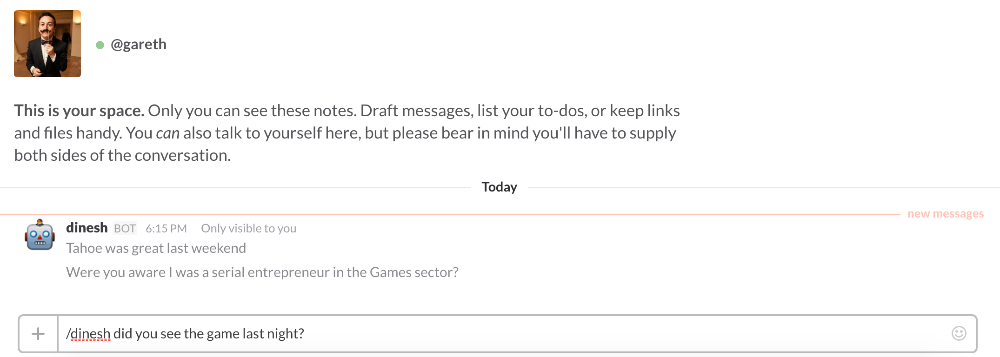

[](https://travis-ci.org/garethpaul/valleybot)

# ValleyBot


A chatbot based on tech talk.

#### Integrations

Here are some popular chatbot integrations.

**Facebook**


**Slack**



**Web**


**Terminal**


## Settings

Currently we have chatbot integrations for Facebook, Slack, Web and Local Access. The settings file contains more information on settings for these bot channels.


## How to get started ?

#####  1.  Initially clone the repo.

```
git clone https://github.com/garethpaul/valleybot.git
```

#####  2.  Get the requirements for the project

```
pip install -r requirements.txt
```

#####  3. (option 1)  Run the server

```
python ./app.py {port}
```

#####  3. (option 2)  Python

 ```
import bot
bot.respond("Hello there valley bot what's going on?")
 ```

## Running Externally

### AWS Lambda

###### 1. Run through the install process above.
###### 2. Zip up the contents of this project.

```
zip -rf ~/ValleyBot.zip *
```

###### 3. Upload the zip to S3
###### 4. Input your S3 url inside Lambda
###### 4. Point your lambda function to run bot.respond_json
###### 5. You will then get a API URL from Lambda to run the bot.


### Heroku

###### 1. Create a Heroku Instance

```
heroku create

```


###### 2. Push to Heroku

```

git push heroku master
```
